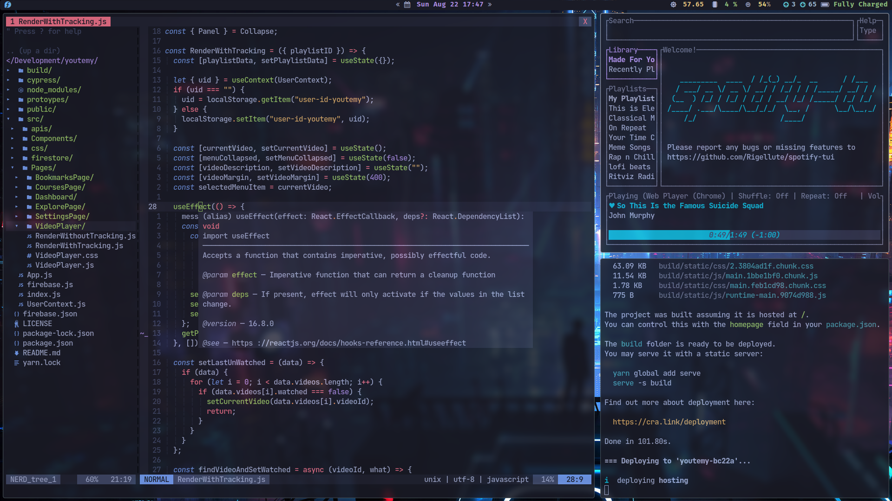

# Flex:

> This is a new repo for my dot files, the reason? well I accidently pushed large files to gh and now those large files lives in the git history of that repo.

- ## Software I Use:
  - [Xmonad](https://xmonad.org/) as my tiling window manager and [Xmobar](https://xmobar.org/#:~:text=Xmobar%20is%20a%20minimalistic%20status%20bar.&text=Xmobar%20was%20inspired%20by%20the,templates%2C%20and%20extensibility%20through%20plugins.) as my panel.
  - [Vim](https://github.com/vim/vim) as my main text editor.
    - Fugitive : VCS bliss
    - COC : Fucking Amazing
    - LightLine : Cool and All
    - Vim Rest Console : REST Goodness
  - [Ranger](https://github.com/ranger/ranger) as my file explorer.
  - [Alacritty](https://github.com/alacritty/alacritty) as my terminal emulator.
  - [OneDark (Customized)](https://github.com/joshdick/onedark.vim) as my colorScheme.
  - [ZSH](https://www.zsh.org/) as my shell.
  - [LSD](https://github.com/Peltoche/lsd) instead of ls.
  - [Picom](https://github.com/yshui/picom) as my compositor.
  - [Rofi](https://github.com/davatorium/rofi) as my application launcher.
  - [Tmux](https://linuxize.com/post/getting-started-with-tmux/) as Terminal Multiplexer

#### The install script can be used as follows:

- <u>Step 1</u>: `git clone https://github.com/rosekamallove/dotFiles ~/`
- <u>Step 2</u>: `chmod +x ~/dotFiles/install.sh`
- <u>Step 3</u>: `./install.sh`

> P.S. I have recently started usign [AstroNvim](https://github.com/AstroNvim/AstroNvim) and I have so far really liked it. Will I completely switch to it? IDK.
